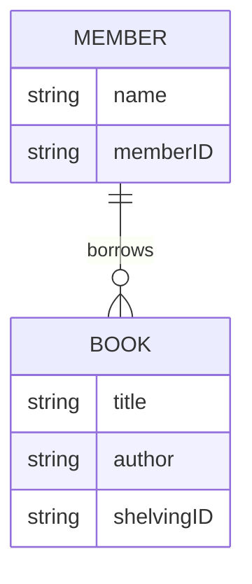

# CROW'S FOOT NOTATION

Visual language used to illustrate the numerical relationship between two entities in an [[02_notes/entity-relationship-diagram|Entity Relationship Diagram]]. This notation denotes two things: cardinality and modality. 

## Cardinality vs Modality

- Cardinality: The maximum number of times an entity instance can occur in a relationship (One or Many)
- Modality: Whether the relationship is required or not (Zero/Optional or One/Mandatory)

## Crow's Foot Symbols

The symbol for Table A in relation to Table B goes next to Table B.

### Basic Symbols

| **Symbol** | **Cardinality** | Modality  |
| ---------- | --------------- | --------- |
| ◯          | Zero            | Optional  |
| \|         | One             | Mandatory |
| <          | Many            | -         |

### Common Combinations 

| Symbol | Meaning                      |
| ------ | ---------------------------- |
| ◯\|    | Optional, At most one        |
| \|\|   | Mandatory, Exactly one       |
| ◯<     | Optional, Multiple possible  |
| \|<    | Mandatory, Multiple possible |

## Main Relationship Types 

- One-to-One (1:1): Each row in Table A relates to exactly one row in Table B
- One-to-Many (1:N): A single row in Table A can relate to many rows in Table B, but each row in Table B relates back to only one row in Table A
- Many-to-Many (M:N): Multiple rows in Table A can relate to multiple rows in Table B

## Example: Library System

We have 2 tables: Member and Book. The rules are that members can borrow zero or many books, and one book can be borrowed by zero or one member at a time. 

