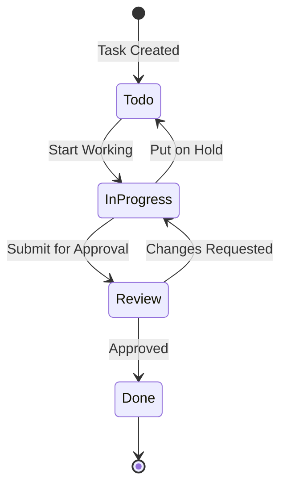

# STATE TRANSITION DIAGRAM

Visual tool used to show the different "states" an object or system can be in, and how it moves from one state to another based on specific inputs or events.

## Key Vocabulary

- **States (状態):** Shows the condition of the system at a specific time
	- Denoted By: Circles or rectangles
	- Examples: "Idle," "Processing," "Error"
- **Transitions (遷移):** Shows the path from one state to another
	- Denoted By: Arrows connecting the states
- **Events/Inputs (イベント/入力):** The "triggers" that cause the state to change
	- Denoted By: Written next to the transition arrows
	- Example: "Button Pressed"
- **Actions (アクション):** The output or operation that occurs during a transition

## Example: Tasks

